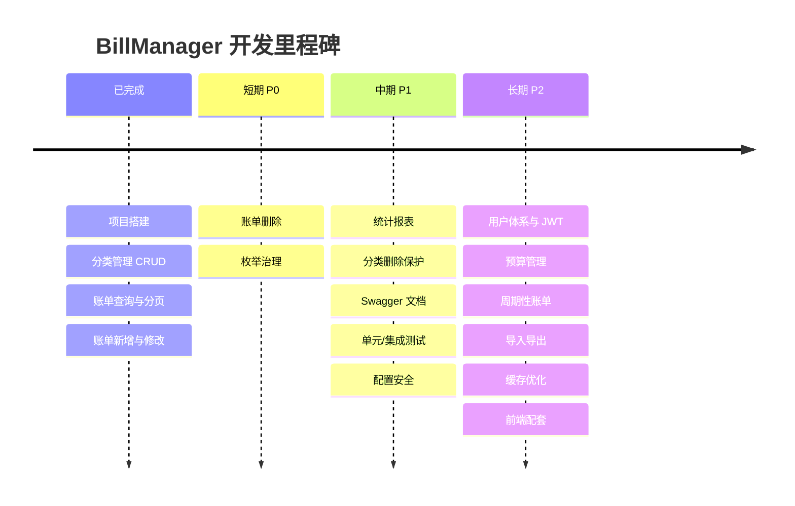

# BillManager 未来开发规划

> 本文档梳理账单管理系统（BillManager）的后续开发方向，按优先级分为短期、中期、长期三个阶段。
> 每完成一项规划，请在对应条目后标注完成日期，并同步更新 [开发日志](开发日志.md)。

---

## 当前状态概览

| 模块 | 已完成 | 待完成 |
|------|--------|--------|
| 分类管理 | 列表查询、新增、修改、逻辑删除 | 分类图标、拖拽排序 |
| 账单管理 | 详情查询、分页组合查询、新增（2026-09-23）、修改（2026-09-23） | 删除、统计 |
| 基础设施 | 统一响应、全局异常、参数校验、字段填充、分页插件 | 用户体系、接口文档、单元测试 |

---

## 短期规划（P0：补齐账单核心 CRUD）

### 1. 账单新增接口 ✅（已完成，2026-09-23）
- `POST /api/bills`，新增 `BillCreatedDTO`：
  - `billAmount`：`@NotNull` + `@DecimalMin("0.01")` + `@Digits(integer=13, fraction=2)`，与数据库 `DECIMAL(15,2)` 对齐。
  - `billType`：限定 `INCOME` / `EXPENSE`（当前用 `@Pattern` 实现，枚举 + 自定义校验注解见第 4 项枚举治理）。
  - `categoryId`：`@NotNull`，业务层校验分类存在、处于启用状态、且分类类型与账单类型一致。
  - `billDate`：`@NotNull`；`remark`：`@Size(max=500)`。

### 2. 账单修改接口 ✅（已完成，2026-09-23）
- `PUT /api/bills/{billId}`，新增 `BillUpdateDTO`（字段与校验规则同新增）。
- 业务校验同新增；账单不存在时抛 404 业务异常（先校验账单存在性，再校验分类合法性）。

### 3. 账单删除接口
- `DELETE /api/bills/{billId}`，基于 `@TableLogic` 的逻辑删除。
- 账单不存在或已删除时抛 404 业务异常。

### 4. 枚举与常量治理
- 将散落的字符串 `"INCOME"` / `"EXPENSE"`、状态码 `404` / `409`、`status` 的 `0/1` 收敛为枚举（`BillType`、`CategoryStatus`）与错误码常量类，消除魔法值。

---

## 中期规划（P1：统计报表与工程化）

### 5. 账单统计接口
- `GET /api/bills/statistics`：按月/按日期范围统计。
  - 总收入、总支出、结余。
  - 按分类汇总（分类 ID、分类名、金额合计、占比），用于前端饼图。
  - 按日/月趋势汇总，用于前端折线图。
- 实现方式：`BillMapper` 自定义 SQL（`SUM` + `GROUP BY`），注意逻辑删除条件与索引利用（`idx_bill_date`、`idx_bill_category_id`）。

### 6. 分类删除的关联保护
- 删除（禁用）分类前检查是否存在关联账单：
  - 方案 A：存在关联账单则拒绝删除，提示"该分类下存在账单，无法删除"。
  - 方案 B：允许禁用，但账单查询需兼容已禁用分类的名称展示（当前 `BillPageVO` 组装逻辑已可兼容，需补充测试）。

### 7. 接口文档
- 引入 SpringDoc OpenAPI（Swagger UI），为 Controller / DTO 补充 `@Operation`、`@Schema` 注解，自动生成在线接口文档。

### 8. 单元测试与集成测试
- Service 层：使用 Mockito 覆盖分类重名校验、禁用分类恢复启用、账单分页组装等核心分支。
- Controller 层：`MockMvc` + `spring-boot-starter-jdbc-test`（或 Testcontainers MySQL）验证接口契约与参数校验。
- 目标：核心业务逻辑测试覆盖率 ≥ 70%。

### 9. 配置安全
- 数据库密码从 [`application.yml`](../src/main/resources/application.yml) 迁移至环境变量或 `application-local.yml`（加入 `.gitignore`），避免敏感信息入库。
- 生产环境关闭 SQL 控制台日志（`log-impl: StdOutImpl`）与 devtools。

---

## 长期规划（P2：用户体系与体验升级）

### 10. 用户模块与多租户隔离
- 新增 `user` 表，`bill` / `category` 表增加 `user_id` 字段。
- 引入认证授权（Spring Security + JWT），所有查询按当前用户隔离数据。
- 分类支持"系统预置分类 + 用户自定义分类"两级体系。

### 11. 预算管理
- 新增 `budget` 表：支持按月设置总预算与分类预算。
- 提供预算执行进度查询接口，超支时返回预警标识。

### 12. 周期性账单
- 支持周期性账单模板（如房租、订阅费），通过定时任务（Spring Scheduler）自动生成账单。

### 13. 数据导入导出
- 支持 Excel / CSV 账单导入（批量校验与错误行反馈）与导出。

### 14. 缓存与性能
- 分类列表读多写少，引入 Spring Cache（Caffeine / Redis）缓存分类数据，分类变更时失效缓存。
- 账单分页深翻页优化（游标分页 / 延迟关联）。

### 15. 前端配套
- 规划配套前端（Vue3 / React），实现账单列表、记账单表单、统计图表（ECharts）、分类管理等页面。

---

## 技术债清单

| 编号 | 问题 | 位置 | 建议 |
|------|------|------|------|
| TD-1 | `Bill.java` 中 `BigInteger` 导入未使用 | [`Bill.java`](../src/main/java/com/example/billmanager/entity/Bill.java) | 删除无用导入 |
| TD-2 | `Category.java` 中 `LocalDate` 导入未使用 | [`Category.java`](../src/main/java/com/example/billmanager/entity/Category.java) | 删除无用导入 |
| ~~TD-3~~ | ~~`BillService` 接口上的 `@Valid` 及校验导入无效~~ | [`BillService.java`](../src/main/java/com/example/billmanager/service/BillService.java) | ✅ 已解决（2026-09-23）：移除接口层 `@Valid` 注解与无用导入 |
| ~~TD-4~~ | ~~`BillService.getBillPage` 的 Javadoc 仍描述旧签名~~ | [`BillService.java`](../src/main/java/com/example/billmanager/service/BillService.java) | ✅ 已解决：Javadoc 已更新为 `billQueryDTO` |
| TD-5 | `category` 表 `update_time` 字段命名与 `bill` 表一致性尚可，但实体填充字段名为 `updateTime`，建议统一为 `updated_time` 风格时同步评估 | [`Sql.sql`](../src/main/resources/Sql.sql) | 保持现状或建库初期统一命名 |
| TD-6 | `BillServiceImpl` 中 `getBillPage` 手动逐字段拷贝到 VO | [`BillServiceImpl.java`](../src/main/java/com/example/billmanager/service/impl/BillServiceImpl.java) | 引入 MapStruct 或 BeanUtils 简化映射 |
| TD-7 | 全局异常处理器未覆盖兜底 `Exception`、`HttpMessageNotReadableException`、`MissingServletRequestParameterException` 等 | [`GlobalExceptionHandler.java`](../src/main/java/com/example/billmanager/exception/GlobalExceptionHandler.java) | 补充兜底处理，避免堆栈直接暴露给前端 |
| TD-8 | `CategoryController` 未使用 `@RequiredArgsConstructor`，与 `BillController` 风格不一致 | [`CategoryController.java`](../src/main/java/com/example/billmanager/controller/CategoryController.java) | 统一构造器注入风格 |
| TD-9 | 数据库密码明文提交风险 | [`application.yml`](../src/main/resources/application.yml) | 见中期规划第 9 项 |

---

## 里程碑视图

